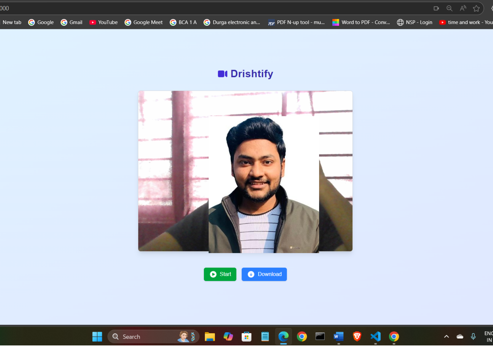

# Drishtify

**Drishtify** is a smart, face-tracking video recorder built with Next.js, face-api.js, and the MediaRecorder API. Designed for real-world use cases like remote job assessments, online proctoring, and behavior monitoring, it captures webcam footage with live face detection and records it with audio for later review.

## Features

- Real-time face detection using `face-api.js`
- Canvas-based video recording with `MediaRecorder`
- Audio recording support
- Downloads recorded videos in `.webm` format
- Saves last recorded video in `localStorage`
- Responsive and clean UI with Tailwind CSS and Heroicons

## Demo



## Use Cases

- Online coding tests and interviews
- Remote exams and assessments
- Behavioral tracking and verification

## Tech Stack

- [Next.js](https://nextjs.org/) – App Framework
- [face-api.js](https://github.com/justadudewhohacks/face-api.js) – Face detection
- [MediaRecorder API](https://developer.mozilla.org/en-US/docs/Web/API/MediaRecorder) – Recording
- [Tailwind CSS](https://tailwindcss.com/) – Styling
- [Heroicons](https://heroicons.com/) – Icons

## Installation

1. **Clone the repository**
   ```bash
   git clone https://github.com/tusharharyana/drishtify.git
   cd drishtify
   ```
2. **Install dependencies**
    ```bash
    npm install
    ```
3. **Download face-api.js models**
- Download the following models from the official [face-api.js model repository](https://github.com/justadudewhohacks/face-api.js-models) and place them in the `public/models/` directory:

    ```bash
    tiny_face_detector_model-weights_manifest.json
    tiny_face_detector_model-shard1
    ```
4. **Run the development server**
    ```bash
    npm run dev
    ```
5. **Open in browser** 
    ```bash 
    http://localhost:3000
    ```

## How It Works
- Video + Audio Capture: Uses getUserMedia to get camera and mic.
- Live Detection: Draws face boxes using face-api.js every few ms.
- Recording: Captures canvas stream + audio and records via MediaRecorder.